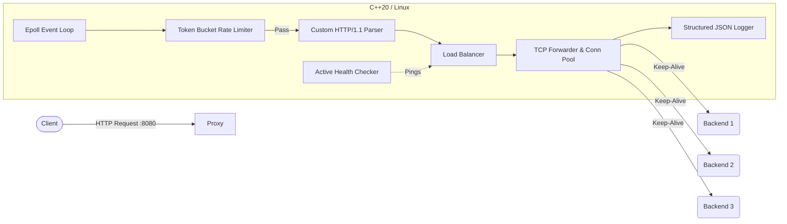

# High-Performance Adaptive Reverse Proxy & Load Balancer

[](https://github.com/01prakash-aditya/adaptive_lb_rp/blob/main/LICENSE)

A systems-level, high-performance reverse proxy and load balancer written from scratch in **C++20**. Designed for high throughput and low latency, this proxy utilizes Linux's `epoll` for non-blocking, event-driven I/O and features a custom-built HTTP/1.1 parser alongside advanced traffic management capabilities.

## Architecture



## Core Features

* **Non-Blocking TCP Core**: Utilizes Linux `epoll` with edge-triggered notifications for highly efficient, asynchronous connection handling.
* **Custom HTTP/1.1 Parser**: Incremental parsing supporting `Content-Length` and chunked `Transfer-Encoding` without relying on external HTTP libraries.
* **Multi-Backend Load Balancing**: Pluggable strategies to route traffic:
  * **Round Robin**: Evenly cycles requests.
  * **Weighted Round Robin**: Adjusts traffic flow based on server capacity.
  * **Least Connections**: Dynamically routes to the least busy server using atomic trackers.
  * **IP Hash**: Ensures session stickiness by hashing the client's IP.
* **Health Checking & Auto-Failover**:
  * *Active Probing*: A background thread continually verifies backend availability.
  * *Passive Monitoring*: Detects timeouts or refused connections in real-time.
  * *Zero-Downtime Failover*: Unhealthy nodes are instantly removed from the routing pool.
* **Traffic Control (Rate Limiting)**: Thread-safe Token Bucket implementation offering both **Global** throughput caps and strict **Per-IP** request limits (returns `429 Too Many Requests`).
* **In-Memory LRU Cache**: Intercepts repeated `GET` requests and serves them directly from RAM in <0.5ms, drastically reducing backend load. Features $O(1)$ eviction and configurable TTLs.
* **Connection Pooling**: Drastically reduces latency by caching and reusing idle Keep-Alive TCP sockets instead of initiating a 3-way handshake on every request.
* **Observability & Metrics Stack**: 
  * Structured JSON logging (injects `X-Request-ID` and `X-Forwarded-For`).
  * Lock-free `std::atomic` C++ metrics registry.
  * Native `/metrics` endpoint serving Prometheus-compatible exposition format.
  * Pre-provisioned Grafana dashboards tracking RPS, cache hit rates, and latency.

## Technology Stack

| Component | Technology |
| :--- | :--- |
| **Proxy Core** | C++20 (POSIX sockets, `epoll`) |
| **Compiler / Build** | GCC 12+, CMake (3.20+), Ninja |
| **Containerization** | Docker, Docker Compose |
| **Observability** | Prometheus, Grafana |
| **Testing** | Go (Load Tester), Python 3 (Validation Scripts) |
| **Dummy Backends** | Python 3.11, Flask |

## Getting Started

The entire environment (proxy, 3 backend instances, Prometheus, and Grafana) is containerized for easy testing.

### 1. Start the Environment
Spin up the reverse proxy and the stack on a shared Docker network:
```bash
docker compose -f docker/docker-compose.yml up --build -d
```

### 2. View Live Metrics Dashboard
Open your browser and navigate to the pre-provisioned Grafana dashboard:
* **URL:** `http://localhost:3000`
* **Credentials:** `admin` / `admin`

### 3. Verify Traffic Routing (Distribution Test)
The proxy listens on `localhost:8080`. You can automatically test the load balancing distribution using the provided Python script:
```bash
python scripts/test_distribution.py http://localhost:8080/
```

### 4. Test In-Memory Caching
Run a curl command twice. The second response will bypass the backend entirely and include an `X-Cache: HIT` header:
```bash
curl -v http://localhost:8080/
```

### 5. Run the High-Concurrency Load Tester
We built a custom Go-based load tester to push the proxy to its limits and trigger the Token Bucket rate limiters. Run it via Docker:
```bash
docker compose -f docker/docker-compose.yml run --rm load_tester --url http://proxy:8080/ --concurrency 50 --duration 10
```
*(Watch the Grafana dashboard while this runs to see the traffic spikes in real time!)*

## Further ideas:

- [ ] Adaptive Load Balancing: Real-time feedback loops based on latency metrics.

## License

This project is licensed under the MIT License.
