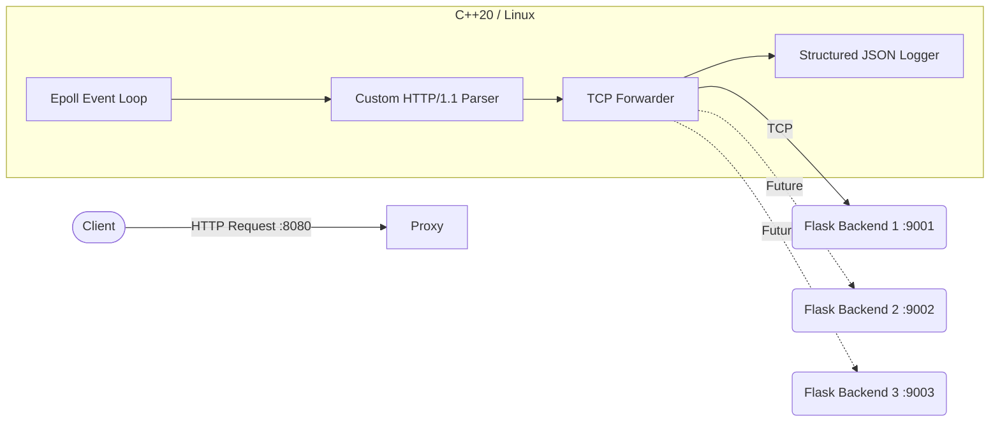

# High-Performance Adaptive Reverse Proxy & Load Balancer

A systems-level, high-performance reverse proxy and load balancer written from scratch in **C++20**. Designed for high throughput and low latency, this proxy utilizes Linux's `epoll` for non-blocking, event-driven I/O and features a custom-built HTTP/1.1 parser.

## Architecture Flow



## Current Features

* **Non-Blocking TCP Core**: Utilizes Linux `epoll` with edge-triggered notifications for highly efficient, asynchronous connection handling.
* **Custom HTTP/1.1 Parser**: Incremental parsing supporting `Content-Length` and chunked `Transfer-Encoding` without relying on external HTTP libraries.
* **Reliable Request Forwarding**: Routes traffic to backends, relays exact responses, and gracefully handles connection timeouts and failures (502/504).
* **Observability**: Thread-safe structured JSON logging recording latency, HTTP methods, and status codes.
* **Distributed Tracing Support**: Automatically injects `X-Request-ID` (UUIDv4) and `X-Forwarded-For` headers into relayed requests.

## Technology Stack

| Component | Technology |
| :--- | :--- |
| **Proxy Core** | C++20 (POSIX sockets, `epoll`) |
| **Compiler / Build** | GCC 12, CMake (3.20+), Ninja |
| **Containerization** | Docker, Docker Compose (Multi-stage builds) |
| **Dummy Backends** | Python 3.11, Flask |

## Getting Started

The entire environment (proxy + dummy backends) is containerized for easy testing. 

### 1. Start the Environment
Spin up the reverse proxy and the backend instances on a shared Docker network:
```bash
docker-compose -f docker/docker-compose.yml up --build
```

### 2. Verify Traffic Forwarding
Once running, the proxy listens on `localhost:8080`. You can test it using the following commands:

**Standard GET Request:**
```bash
curl http://localhost:8080/
```
*(Expected: 200 OK with a JSON response containing a timestamp from the backend).*

**POST Request (Body Echoing):**
```bash
curl -X POST -d '{"key":"value"}' -H "Content-Type: application/json" http://localhost:8080/echo
```
*(Expected: The backend echoes the exact JSON body back to you).*

**Health Check Endpoint:**
```bash
curl http://localhost:8080/health
```

### 3. Inspect Observability Logs
The proxy emits structured JSON logs. Open a new terminal and run:
```bash
docker logs reverse_proxy
```
*Example Log Output:*
```json
{"timestamp":"2026-08-26T12:00:00Z", "level":"INFO", "request_id":"a1b2c3d4-...", "method":"GET", "uri":"/", "status":200, "latency_ms":12.5, "backend":"127.0.0.1:9001"}
```

## Plan Ahead

Further our development will generalize the proxy to support multiple backends and implement pluggable load-balancing algorithms:

- Backend Pool Data Structure
- **Round Robin** Load Balancing
- **Weighted Round Robin**
- **Least Connections** (active connection tracking)
- **IP Hash** (sticky sessions)

## License

This project is licensed under the MIT License - see the LICENSE file for details.
